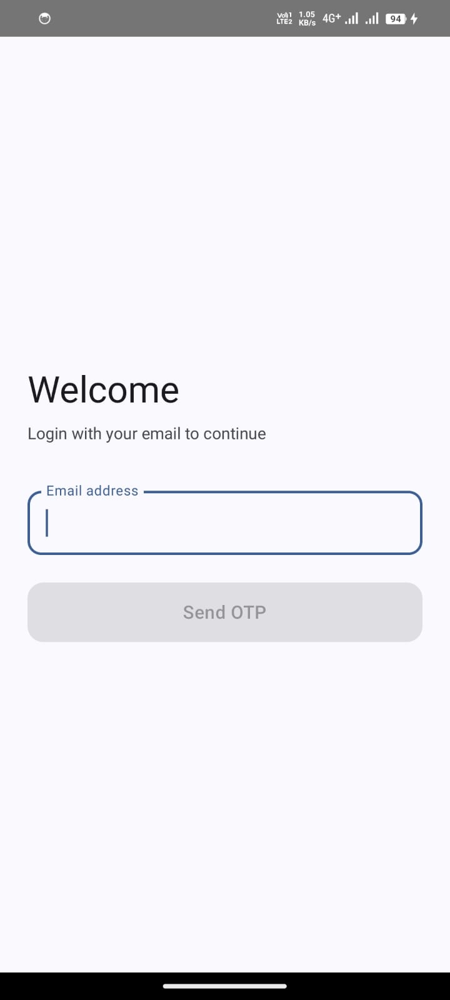
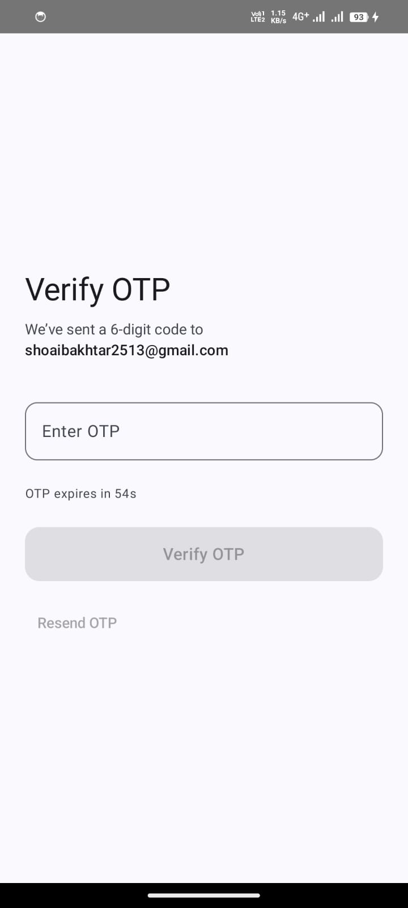
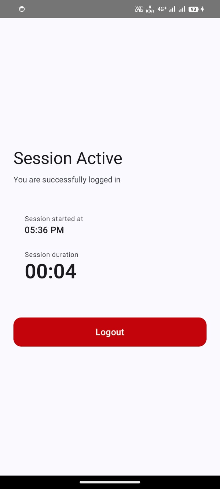

# Lokal Android Assignment – Passwordless OTP Authentication

This project implements a **passwordless authentication flow using Email + OTP**, built entirely with **Jetpack Compose** and **Kotlin**, as part of the Lokal Android Developer assignment.

The app demonstrates clean architecture, proper state management, and handling of real-world edge cases without using any backend.

---
## 📸 Screenshots

  
  
  

## 🛠 Tech Stack

* **Language:** Kotlin  
* **UI:** Jetpack Compose (Material 3)  
* **Architecture:** ViewModel + UI State (StateFlow)  
* **Concurrency:** Kotlin Coroutines  
* **Logging SDK:** Timber  

---

## 🔐 Authentication Flow

### 1. Email Login
* User enters an email address
* Clicks **Send OTP**
* A **6-digit OTP** is generated locally

### 2. OTP Validation Rules
* OTP length: **6 digits**
* OTP expiry: **60 seconds**
* Maximum attempts: **3**
* Resending OTP:
  - Invalidates old OTP
  - Resets attempt count

OTP data is stored **per email** in-memory.

---

## ⏱ Session Screen

After successful OTP verification:
* Session start time is shown
* Live session duration is displayed in **mm:ss**
* Logout button ends the session

The session timer:
* Survives recompositions
* Stops correctly on logout

---

## 🧠 Architecture & State Management

* All business logic is handled inside **AuthViewModel**
* UI is fully state-driven using **StateFlow**
* One-way data flow is maintained:
  
  `UI → ViewModel → State → UI`

No UI logic exists inside the ViewModel.

---

## 🔁 Screen Rotation Handling

Screen rotation does **not break state** because:
* All critical data (email, OTP, timers, session state) is stored in the ViewModel
* ViewModel survives configuration changes

OTP countdown and session timer continue correctly after rotation.

---

## ⚠️ Edge Cases Handled

* ✅ Incorrect OTP
* ✅ Expired OTP
* ✅ Exceeded OTP attempts (redirects to Login with error message)
* ✅ Resend OTP flow
* ✅ Back navigation from OTP screen to Login
* ✅ Screen rotation safety

---

## 📊 Analytics / Logging

**Timber** is integrated as the external SDK (as required).

Logged events:
* OTP generated
* OTP validation success
* OTP validation failure
* Logout

Timber is initialized in the `Application` class and accessed via a dedicated `AnalyticsLogger`.

> Note: OTP is logged to Logcat for local testing purposes only, since no backend is required.

---

## 🤖 AI Usage Disclosure

GPT was used for:
* Code structure guidance
* Jetpack Compose best practices
* Architecture validation

All logic was **understood, reviewed, and implemented manually**.

---

## ▶️ How to Run the App

1. Clone the repository
2. Open in Android Studio
3. Sync Gradle
4. Run on emulator or physical device (Android 8+)

No additional setup is required.

---

## 📌 Author

**Shoaib Akhtar**  
Android Developer 
